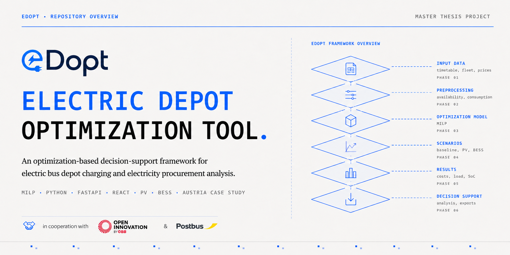

<div align="center">
  
</div>

<br>

<div align="center">

# eDOPT

**Electric Depot Optimization & Planning Tool**

A web-based research prototype for analyzing electricity procurement and charging schedules in battery-electric bus depots.

[](LICENSE)
[](https://www.python.org/)
[](https://fastapi.tiangolo.com/)
[](https://reactjs.org/)
[](https://vitejs.dev/)
[](https://www.awattar.at/)
[](https://open-meteo.com/)
[](https://coin-or.github.io/pulp/)

[Research Context](#research-context) • [Purpose and Scope](#purpose-and-scope) • [Main Functions](#main-functions) • [Architecture](#architecture) • [Quick Start](#quick-start) • [License](#license)

</div>

---

## Research Context

eDOPT was developed by **Martin Pfeiffer, BSc.** as the software artifact of the master's thesis:

> *Electricity Procurement Cost Minimization for Depot Charging of Electric Buses: An Optimization-Based Decision-Support Framework*

The thesis was conducted at the **Vienna University of Economics and Business (WU Vienna)**, within the **Institute for Data, Energy, and Sustainability (IDEaS)** at the Department of Information Systems and Operations Management.

Academic supervision was provided by **Behnam Zakeri, DSc.**, with **Dr. Amin Anjomshoaa** as co-supervisor. The project was developed in cooperation with the **ÖBB Open Innovation** and **Postbus GmbH**. The industry partners contributed to the underlying problem definition, provided operational context and case-study data, and supported the applied development of the framework.

The repository contains the implementation of the decision-support tool developed for the thesis. Confidential operational data used in the Wels case study are not included.

---

## Purpose and Scope

Electric bus depots must supply the energy required by their fleets within charging windows defined by fixed vehicle circulation plans. At the same time, charging is constrained by vehicle availability, battery limits, charger capacity, and the depot grid connection. When electricity prices vary over time, the allocation of charging demand across feasible periods can influence procurement costs.

eDOPT represents this problem as a mixed-integer linear programming model. The model determines charging schedules within the available depot windows while respecting bus-level and depot-level constraints. Optional scenario extensions include photovoltaic generation and a stationary battery energy storage system.

The tool is intended for:

- scenario analysis and research
- evaluation of charging schedules under time-varying electricity prices
- comparison of charge-on-arrival and optimized charging strategies
- analysis of PV and BESS integration under defined assumptions
- preparation of operational cost estimates for further planning or investment analysis

The tool is **not** a real-time charging controller. It does not communicate with physical chargers, modify vehicle timetables, or provide a complete investment appraisal. Results depend on the uploaded operational data and the selected technical, economic, and infrastructure assumptions.

---

## Main Functions

| Function | Description |
| :--- | :--- |
| **MILP optimization** | Uses PuLP and CBC to allocate charging power across buses and time periods under the configured constraints. |
| **Vehicle circulation processing** | Converts compatible vehicle circulation plans into bus-specific availability windows and trip-energy profiles. |
| **Electricity price inputs** | Supports time-varying Austrian electricity price data, fixed prices, and additional variable price components. |
| **Bus-level constraints** | Represents battery capacity, state of charge, charging efficiency, maximum charging power, scheduled energy consumption, and readiness requirements. |
| **Depot-level constraints** | Represents charging socket availability, aggregate charger capacity, and the depot grid connection limit. |
| **PV and BESS scenarios** | Extends the depot energy balance with photovoltaic generation, stationary storage, curtailment, and storage operation. |
| **Result visualization** | Displays charging profiles, state-of-charge trajectories, electricity prices, costs, grid imports, and scenario-specific energy flows. |
| **Scenario comparison** | Compares reference and optimized configurations using common operational input data. |
| **Data export** | Exports schedules, time series, cost summaries, and scenario results to Excel or CSV where supported. |

---

## Architecture

The application follows a modular client-server architecture:

```text
┌───────────────────────────────────────────────────────────────────┐
│                    React + Vite Web Interface                     │
│        Input configuration, scenario setup, charts, tables        │
└─────────────────────────────────┬─────────────────────────────────┘
                                  │ REST API (JSON)
┌─────────────────────────────────▼─────────────────────────────────┐
│                         FastAPI Backend                           │
│       Request handling, preprocessing, external data services     │
└─────────────────────────────────┬─────────────────────────────────┘
                                  │ Model data and constraints
┌─────────────────────────────────▼─────────────────────────────────┐
│                       MILP Model with PuLP                        │
│            Charging, grid, PV, BESS, and SoC constraints          │
└─────────────────────────────────┬─────────────────────────────────┘
                                  │ CBC solver
┌─────────────────────────────────▼─────────────────────────────────┐
│                    Structured Results and Exports                 │
│       Costs, charging schedules, SoC profiles, energy flows       │
└───────────────────────────────────────────────────────────────────┘
```

The frontend is responsible for user interaction and result presentation. The backend prepares uploaded data, retrieves external inputs where required, constructs the selected optimization scenario, executes the solver, and returns structured results.

---

## Quick Start

### Prerequisites

- **Node.js** 18.0 or higher and **npm**
- **Python** 3.10 or higher
- Windows for the provided `.cmd` setup and start scripts

### 1. Installation

Clone the repository and run the provided dependency installer:

```bash
git clone https://github.com/Gather9182/eDOPT.git
cd eDOPT
install_dependencies.cmd
```

The script creates the backend virtual environment and installs the frontend and backend dependencies.

Manual installation is also possible:

```bash
# Frontend
cd frontend
npm install
cd ..

# Backend
cd backend
python -m venv .venv
.venv\Scripts\activate
pip install -r requirements.txt
```

### 2. Running the Application

Start the frontend and backend using:

```bash
start_all.cmd
```

The default local services are:

- **Frontend:** [http://localhost:5173](http://localhost:5173)
- **Backend:** [http://localhost:8000](http://localhost:8000)
- **API documentation:** [http://localhost:8000/docs](http://localhost:8000/docs)

---

## Repository Structure

```text
eDOPT/
├── backend/
│   ├── app/
│   │   ├── main.py                  # FastAPI entry point and API endpoints
│   │   ├── models.py                # Request and response data models
│   │   ├── services/
│   │   │   ├── solver.py            # MILP model and optimization logic
│   │   │   ├── price_service.py     # Electricity price retrieval and processing
│   │   │   └── pv_service.py        # PV generation estimation
│   │   └── utils/
│   │       ├── excel_processor.py   # Vehicle circulation plan processing
│   │       └── excel_exporter.py    # Result export generation
│   └── requirements.txt             # Python dependencies
├── frontend/
│   ├── src/
│   │   ├── pages/                   # Main application views
│   │   ├── components/              # Interface components and charts
│   │   ├── services/                # Backend API client
│   │   └── App.jsx                  # Application state and routing
│   ├── package.json                 # Frontend dependencies and scripts
│   └── vite.config.js               # Vite configuration
├── assets/
│   └── edopt-repository-banner.png  # README and repository banner
├── install_dependencies.cmd         # Dependency installation script
├── start_all.cmd                    # Frontend and backend launcher
├── start_backend.cmd                # Backend launcher
├── start_frontend.cmd               # Frontend launcher
├── LICENSE                          # License terms
└── README.md                        # Repository documentation
```

---

## Workflow

1. **Upload operational data:** Provide a compatible vehicle circulation plan or use the included non-confidential example input.
2. **Review preprocessing:** Inspect the derived vehicle availability and trip-energy structures.
3. **Configure the depot:** Define vehicle assumptions, charger capacity, charging sockets, grid connection limits, and state-of-charge requirements.
4. **Configure prices:** Select time-varying or fixed electricity prices and define additional variable procurement components.
5. **Select a scenario:** Run the optimized baseline, PV, BESS, or combined PV-BESS model.
6. **Execute the optimization:** Solve the configured model and review solver and feasibility information.
7. **Analyze the results:** Inspect charging schedules, state-of-charge profiles, costs, grid imports, PV utilization, and BESS operation.
8. **Compare and export:** Compare scenarios and export relevant result data.

---

## Data Availability and Reproducibility

The original vehicle circulation plan used for the Wels case study is not included because it contains depot-specific operational information provided by the industry partners. The exact empirical case study therefore cannot be reproduced from this repository alone.

A non-confidential example input is provided to demonstrate the input structure and application workflow. The tool can also be applied to other compatible vehicle circulation plans. Depending on the data source, depot identifiers, operating-day filters, vehicle assumptions, and scenario parameters may need to be adjusted.

Electricity price and weather-related inputs can be retrieved from external services integrated into the application. Availability, formats, and values returned by these services may change over time.

---

## Methodological Notes

The optimization results should be interpreted as scenario-based outputs under the selected assumptions. In particular:

- the vehicle circulation plan is treated as fixed
- charging is optimized only within the derived availability windows
- the model uses deterministic input data for each optimization run
- results depend on the selected planning horizon and end-of-horizon requirements
- PV and BESS scenarios represent operational energy flows, not complete investment cases
- capital expenditure, financing, maintenance, degradation, and replacement costs are outside the model scope
- PV export and BESS electricity sales are not represented in the current formulation

The implementation includes fallback and diagnostic functions for testing and scenario exploration. The thesis results are based on successful runs of the exact MILP formulation.

---

## License

The repository is provided for non-commercial academic, research, educational, and evaluation purposes under the terms stated in the [LICENSE](LICENSE) file.

Commercial use, redistribution as part of a paid service, or incorporation into commercial software requires prior written permission from the author.

---

## Acknowledgements

This project was developed as part of a master's thesis at WU Vienna under the supervision of **Behnam Zakeri, DSc.**, with **Dr. Amin Anjomshoaa** as co-supervisor.

The practical problem setting and case-study context were developed in cooperation with the **ÖBB Open Innovation** and **Postbus GmbH**. Particular thanks are due to **Jan Hilmar, PhD**, and **Felix Grossar, MA**, for their guidance, operational insights, and support with the case-study data.

<div align="center">
  <sub>Master's thesis project by Martin Pfeiffer, BSc. | WU Vienna | In cooperation with ÖBB Open Innovation and Postbus GmbH</sub>
</div>
